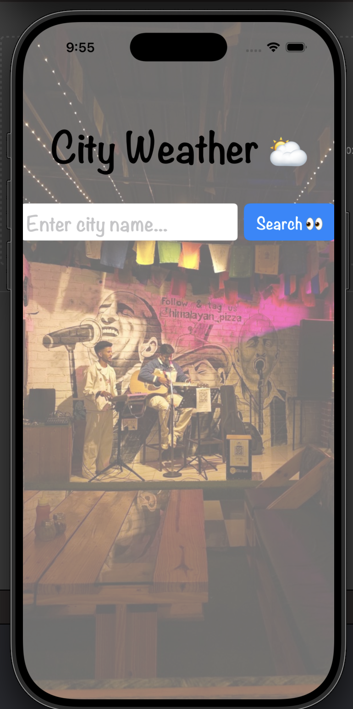
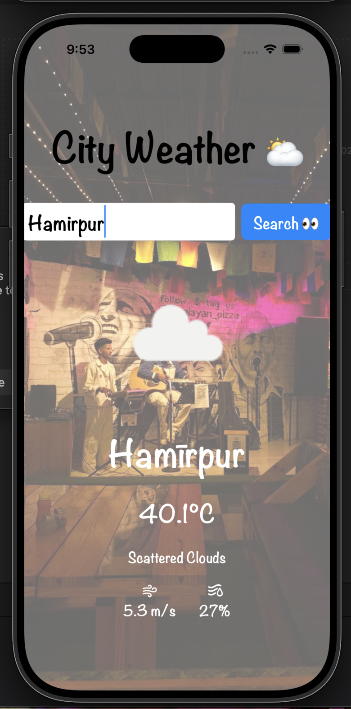

# 🌤️ WeatherApp

<p align="center">
  
</p>

<p align="center">
  <strong>A modern iOS Weather Application built with SwiftUI using the OpenWeather API.</strong>
</p>

<p align="center">
  
  
  
  
  
  
</p>

---

## 📖 Overview

WeatherApp is a clean and modern iOS application developed using **SwiftUI** and the **MVVM architecture**. It allows users to search for any city and instantly view real-time weather information using the OpenWeather API.

The application focuses on simplicity, responsive UI, and asynchronous networking using Swift's modern concurrency features.

---

# ✨ Features

* 🔍 Search weather by city name
* 🌡️ Live temperature updates
* 🌤 Weather condition display
* 💨 Wind speed information
* 💧 Humidity percentage
* ☁️ Dynamic weather icons
* ⚡ Fast API response
* 🎨 Beautiful SwiftUI interface
* 📱 Native iOS application
* 🏗 MVVM Architecture

---

# 📸 Screenshots

| Home Screen                                         | Weather Result                                         |
| --------------------------------------------------- | ------------------------------------------------------ |
|  |  |

<br>

| Another City                                         | App Icon                                         |
| ---------------------------------------------------- | ------------------------------------------------ |
|  |  |

---

# 🛠 Tech Stack

| Technology      | Usage                    |
| --------------- | ------------------------ |
| Swift           | Programming Language     |
| SwiftUI         | User Interface           |
| MVVM            | Application Architecture |
| URLSession      | Networking               |
| Async/Await     | Asynchronous API Calls   |
| OpenWeather API | Weather Data             |

---

# 🏗 Architecture

```
                View
                  │
                  ▼
            ViewModel
                  │
                  ▼
            URLSession
                  │
                  ▼
          OpenWeather API
                  │
                  ▼
               JSON
```

The application follows the **MVVM (Model-View-ViewModel)** architecture, ensuring a clean separation between UI and business logic.

---

# 🌐 API Used

**OpenWeather API**

Features used:

* Current Weather
* Weather Icons
* Temperature
* Wind Speed
* Humidity

---

# 📂 Project Structure

```
WeatherApp
│
├── WeatherApp
│   ├── ContentView.swift
│   ├── ViewModel.swift
│   ├── WeatherApp.swift
│   └── Assets.xcassets
│
├── Screenshots
│   ├── app-icon.png
│   ├── home-screen.png
│   ├── weather-result.png
│   └── another-city.png
│
├── README.md
└── .gitignore
```

---

# 🚀 Getting Started

## Clone Repository

```bash
git clone https://github.com/Veer666/WeatherApp.git
```

Move into the project.

```bash
cd WeatherApp
```

Open using Xcode.

```bash
open WeatherApp.xcodeproj
```

Run the project using the iOS Simulator.

---

# ⚙️ Requirements

* macOS
* Xcode 16+
* iOS 18+
* Swift 5.9+

---

# 🔑 API Configuration

Create your own API key from **OpenWeather**.

Replace the API key inside the ViewModel.

```swift
let apiKey = "YOUR_API_KEY"
```

---

# 🔮 Future Improvements

* 📍 Current Location Weather
* ⭐ Favorite Cities
* 🌙 Dark Mode
* 📅 7-Day Forecast
* ⏰ Hourly Forecast
* 🌧 Weather Alerts
* 📌 Recent Searches
* 🌍 Multiple Language Support

---

# 📚 What I Learned

While building this project I learned:

* SwiftUI
* MVVM Architecture
* REST APIs
* JSON Decoding
* URLSession
* Async/Await
* State Management
* Error Handling
* Building Native iOS Apps

---

# 👨‍💻 Developer

**Vir Daksh Kumar**

Computer Science Engineering Student

NIT Hamirpur

GitHub

https://github.com/Veer666

---

# 🤝 Contributing

Contributions are welcome.

If you'd like to improve the project:

1. Fork the repository.
2. Create your feature branch.
3. Commit your changes.
4. Push your branch.
5. Open a Pull Request.

---

# ⭐ Support

If you found this project useful:

⭐ Star the repository

🍴 Fork the repository

Share it with other developers.

---

# 📄 License

This project is licensed under the MIT License.

---

<p align="center">

Made with ❤️ using SwiftUI

</p>
